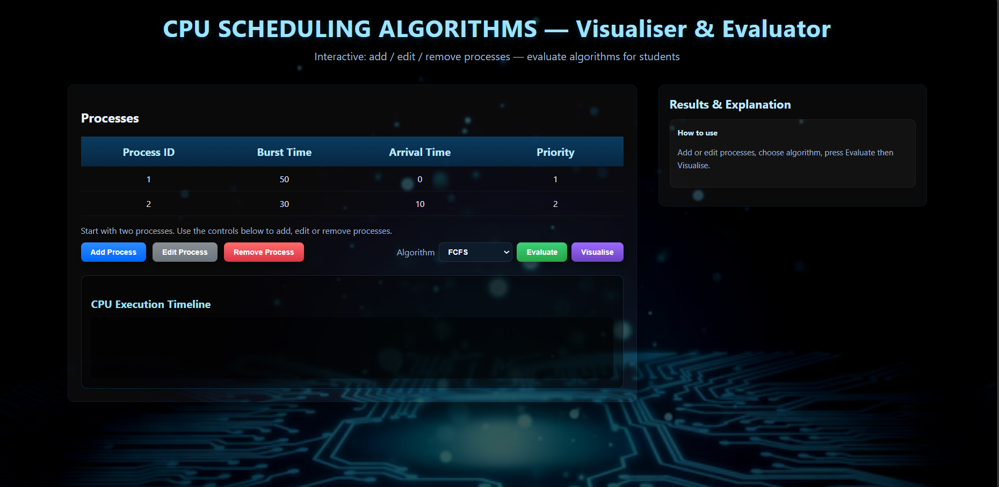
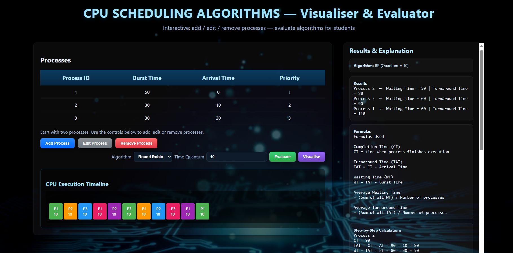

# CPU Scheduling Algorithms Visualizer & Evaluator

An interactive **Operating System simulation tool** that demonstrates how different CPU scheduling algorithms work.
This web-based application allows users to input processes and visualize how the CPU executes them using common scheduling strategies.

The simulator also calculates **Waiting Time**, **Turnaround Time**, and displays a **visual execution timeline (Gantt-style visualization)** to help students understand scheduling behavior.

---

# Project Preview





---

# Features

* Interactive **process creation, editing, and deletion**
* Supports multiple **CPU scheduling algorithms**
* Automatic calculation of:

  * Waiting Time
  * Turnaround Time
  * Average metrics
* **Step-by-step calculation explanation**
* **Execution timeline visualization**
* Educational **formulas and explanations**
* Clean **dashboard-style interface**

---

# Supported Algorithms

The simulator currently supports the following CPU scheduling algorithms:

### 1️⃣ FCFS (First Come First Served)

Processes are executed in the order they arrive.

Characteristics:

* Non-preemptive
* Simple to implement
* Can cause **convoy effect**

---

### 2️⃣ SJF (Shortest Job First)

The process with the **smallest burst time** executes first.

Characteristics:

* Minimizes average waiting time
* Can cause **starvation for long processes**

---

### 3️⃣ Priority Scheduling

Processes execute based on **priority level**.

Characteristics:

* Lower number = higher priority
* Can cause starvation without **aging**

---

### 4️⃣ Round Robin

Each process gets a **fixed time quantum**.

Characteristics:

* Fair CPU distribution
* Prevents starvation
* Common in **time-sharing systems**

---

# Performance Metrics

The simulator calculates key scheduling metrics used in operating systems.

### Completion Time (CT)

Time when the process finishes execution.

```
CT = Finish Time
```

---

### Turnaround Time (TAT)

Total time from process arrival to completion.

```
TAT = Completion Time - Arrival Time
```

---

### Waiting Time (WT)

Time a process spends waiting in the ready queue.

```
WT = Turnaround Time - Burst Time
```

---

### Average Waiting Time

```
Average WT = (Sum of all WT) / Number of Processes
```

---

### Average Turnaround Time

```
Average TAT = (Sum of all TAT) / Number of Processes
```

---

# Visualization

The **CPU Execution Timeline** visually represents how processes are scheduled.

Each colored block represents:

* A process
* The time duration it occupies the CPU

Example visualization:

```
| P1 | P1 | P1 | P2 | P2 |
```

For Round Robin, processes may appear multiple times because execution occurs in **time slices**.

---

# Project Structure

```
CPU-Scheduling-Visualizer
│
├── index.html
├── style.css
├── script.js
├── bg.jpg
│
└── images
    ├── main-ui.png
    └── timeline.png
```

---

# Installation

Clone the repository:

```
git clone https://github.com/yourusername/cpu-scheduling-visualizer.git
```

Navigate into the project folder:

```
cd cpu-scheduling-visualizer
```

Open the project in a browser:

```
open index.html
```

or simply double-click the file.

No additional dependencies are required.

---

# How to Use

1️⃣ Add processes using **Add Process**

2️⃣ Enter:

* Process ID
* Burst Time
* Arrival Time
* Priority

3️⃣ Select a scheduling algorithm

4️⃣ Click **Evaluate**

This calculates:

* Waiting Time
* Turnaround Time
* Average Metrics

5️⃣ Click **Visualise**

This displays the **CPU execution timeline**.

---

# Technologies Used

* HTML5
* CSS3
* JavaScript
* DOM Manipulation
* Scheduling Algorithm Logic

---

# Educational Purpose

This project was developed as an **Operating Systems learning tool** to help students understand how CPU scheduling algorithms work in real operating systems.

It demonstrates:

* Process scheduling
* CPU allocation
* Performance metrics
* Algorithm comparison

---

# Future Improvements

Possible enhancements:

* Animated **Gantt chart timeline**
* Step-by-step execution simulation
* Preemptive algorithms:

  * Shortest Remaining Time First
  * Preemptive Priority
* Graph comparison of algorithm performance
* Export results as PDF
* Dark/light UI themes

---

# Author

Developed as part of an **Operating Systems visualization project** to demonstrate CPU scheduling algorithms interactively.

---

# License

This project is open-source and available under the **MIT License**.
